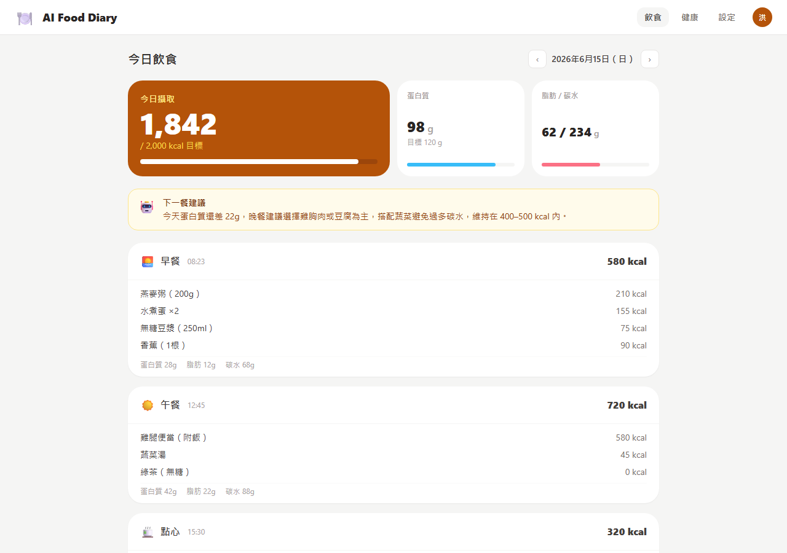
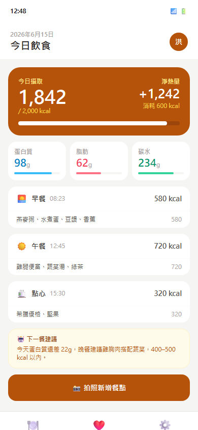
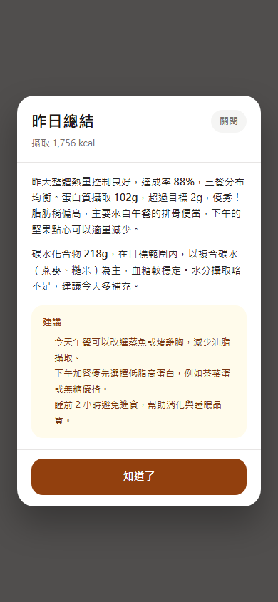
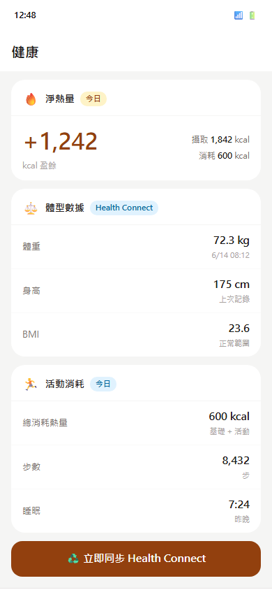

# 🍽️ AI Food Diary · AI 飲食記錄

> Snap a photo — AI estimates calories & macros, then writes you a personalised daily summary.  
> Web 與 Android App 共用同一後端與版本號，一個 tag 同時發佈兩端。

<p>
  
  
  
  
  
</p>

---

## 🖼️ 截圖預覽

### Web — 儀表板 / 飲食頁

<p align="center">
  
</p>

### App（Android）

<p align="center">
  
  &nbsp;&nbsp;
  
  &nbsp;&nbsp;
  
</p>
<p align="center"><sub>飲食儀表板 · 昨日 AI 總結彈窗 · 健康同步</sub></p>

---

## ✨ 功能亮點

| 功能 | 說明 |
|------|------|
| 📸 **AI 餐點辨識** | OpenAI Vision 由照片估算熱量與蛋白質／脂肪／碳水，支援手動修正後重新辨識 |
| 🎯 **精準模式** | 同一張照片多次取樣取「總熱量中位數」，大幅降低辨識飄動 |
| 🌙 **昨日總結自動彈窗** | Worker 依各使用者時區於凌晨事前產生；App／Web 每日首次開啟自動彈出，不跑即時 AI |
| 🍱 **常用食物 / 條碼 / 營養標示** | 自建食物庫、掃條碼、輸入營養標示（熱量與三大營養素皆支援小數） |
| ❤️ **Health Connect 同步** | Android 同步體重、身高、活動消耗，自動計算當日淨熱量 |
| 🔐 **隱私與加密** | AES-256-GCM 欄位加密；每位使用者自帶 AI 金鑰，加密儲存後端解密，不共用額度 |

---

## 🧱 技術架構

| 層 | 技術 |
|----|------|
| 前端（Web） | Next.js App Router + TypeScript |
| 前端（App） | Flutter（Android）|
| 資料庫 | Prisma + PostgreSQL |
| 認證 | Argon2id 密碼雜湊 · JWT HttpOnly Cookie Session |
| 加密 | AES-256-GCM 欄位加密 |
| AI | OpenAI Responses API（支援 OpenAI-compatible endpoint）|
| 背景工作 | Redis + BullMQ worker（昨日總結事前產生）|
| 部署 | Docker Compose：app · worker · postgres · redis · minio |

---

## 🚀 快速開始

1. 安裝 **Node.js 22+** 與 **Docker**。
2. 複製 `.env.example` 為 `.env`。
3. 產生 32-byte base64 加密金鑰並填入 `ENCRYPTION_KEY`：

   ```powershell
   [Convert]::ToBase64String((1..32 | ForEach-Object { Get-Random -Maximum 256 }))
   ```

4. 填入 `AUTH_SECRET` 與 `OPENAI_API_KEY`。
   - 使用 OpenAI 官方 API 時可留空 `OPENAI_BASE_URL`。
   - 使用 OpenAI-compatible API 時，將 `OPENAI_BASE_URL` 設為相容服務的 `/v1` endpoint，例如 `https://api.example.com/v1`。
5. 啟動服務（會一併啟動 **worker**，昨日總結排程才會運作）：

   ```bash
   docker compose up --build
   ```

6. 開啟 <http://localhost:3000>。

---

## 🛠️ 本機開發

```bash
npm install
npx prisma generate
npx prisma db push
npm run dev      # Web
npm run worker   # 背景排程（昨日總結事前產生）
```

---

## ⚙️ 進階設定

### Prompt 設定

可在 `.env` 修改 AI 提示語，修改後重啟 app／worker 即可套用：

```env
AI_MEAL_ANALYSIS_PROMPT="餐點圖片分析提示語"
AI_NEXT_MEAL_ADVICE_PROMPT="下一餐建議提示語"
AI_DAILY_SUMMARY_PROMPT="每日總結提示語"
```

模板變數：
- `AI_NEXT_MEAL_ADVICE_PROMPT`：`{{goal}}`、`{{calorieTarget}}`、`{{todayCalories}}`、`{{todayProtein}}`、`{{todayFat}}`、`{{todayCarbs}}`
- `AI_DAILY_SUMMARY_PROMPT`：`{{date}}`、`{{calorieTarget}}`、`{{totalCalories}}`、`{{totalProtein}}`、`{{totalFat}}`、`{{totalCarbs}}`

### 辨識穩定度調校

所有 AI 呼叫都帶入低 `temperature` 與固定 `seed`，並對 JSON 回傳啟用 JSON mode；餐點提示語改為「估份量（公克）→ 取每 100g 密度 → 份量×密度」的分步估算。

以下變數皆為選填，可在 `.env` 覆寫後重啟 app／worker：

```env
AI_ANALYSIS_TEMPERATURE="0.2"             # 越低越穩定，辨識類任務建議 0~0.3
AI_ANALYSIS_SEED="42"                     # 固定種子（OpenAI 系支援）
AI_MEAL_ANALYSIS_SAMPLES="3"              # 精準模式取樣次數，設 1 可停用
AI_MEAL_ANALYSIS_SAMPLE_TEMPERATURE="0.5" # 精準模式各次取樣的 temperature
```

**精準模式**：拍照新增餐點時可勾選「精準模式」，後端對同一張圖跑 `AI_MEAL_ANALYSIS_SAMPLES` 次，取**總熱量中位數**的結果（代價是分析較慢、token 用量約為取樣次數倍）。精準模式勾選框目前僅在 Web。

---

## 📦 發版與 CI

Web 與 App 共用**一個版本 tag**，推送後同時觸發兩個 workflow：

```bash
git tag v0.1.0
git push origin v0.1.0
```

| Workflow | 說明 |
|----------|------|
| `android-apk.yml` | `flutter build apk --release`，上傳 `ai-food-vX.Y.Z.apk` 與 `ai-food-latest.apk` 至 S3 |
| `docker-image.yml` | 建置並推送 Docker image `:X.Y.Z` 與 `:latest` |

需要在 GitHub repository secrets 設定：

```text
DOCKERHUB_USERNAME=你的 Docker Hub 帳號
DOCKERHUB_TOKEN=你的 Docker Hub access token
DOCKERHUB_IMAGE=你的 Docker Hub image，例如 username/ai-food-diary
```

> 安全掃描（gitleaks／Semgrep／Trivy／OSV／MobSF）每天 **03:00（Asia/Taipei）** 排程執行，可於 GitHub Actions 手動觸發。

---

## 📝 備註

- AI 營養分析為估算值；使用者可在 Web／App 修正餐點項目後重新辨識。
- 目前圖片以 data URL 送到 AI，不會保存到 MinIO；MinIO 已在部署環境預留，下一步可改為 private bucket + signed URL。
- Docker runtime 使用 `prisma db push` 方便啟動；正式環境建議改為 migration 流程。
- 昨日總結排程跑在 **worker** 程序，請確認 worker 與 app 使用相同 env（加密金鑰、`DATABASE_URL`、`REDIS_URL`）。
- 磁碟加密屬基礎設施控制；部署 PostgreSQL、MinIO/S3、Docker volume、備份與 VM 磁碟時請依 [`docs/disk-encryption.md`](docs/disk-encryption.md) 驗證。
