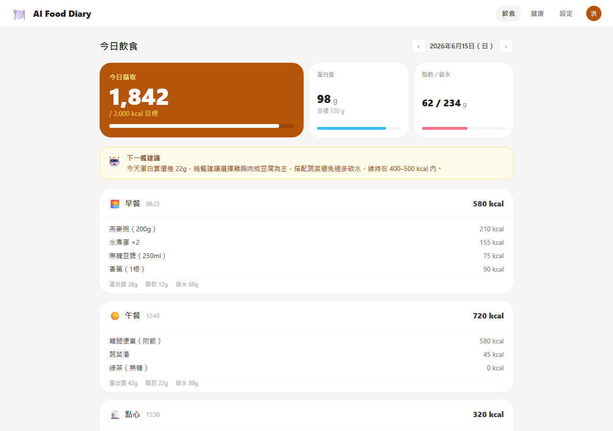
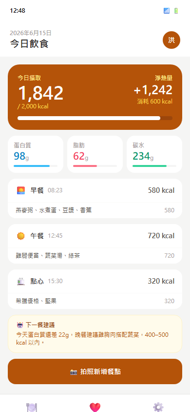
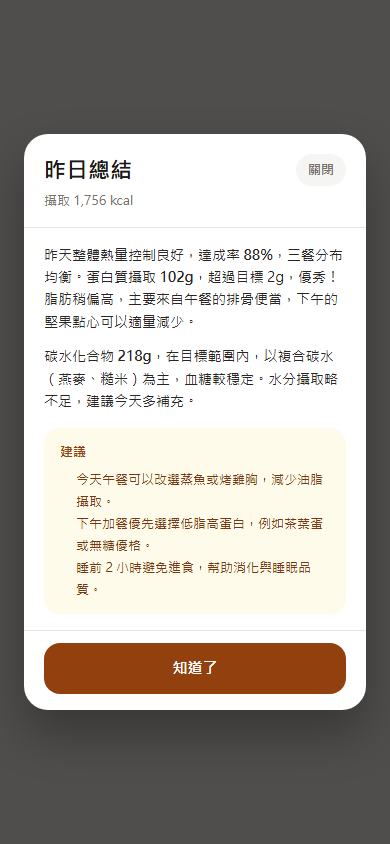
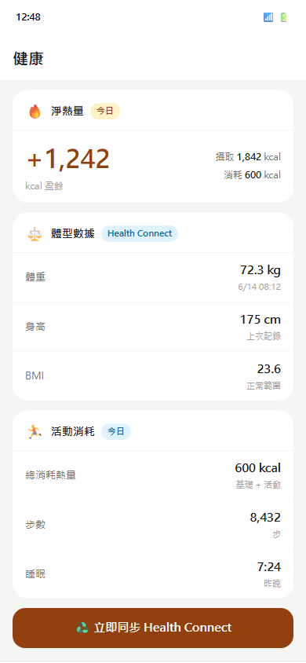

# 🍽️ AI Food Diary · AI 飲食記錄

> Snap a photo — AI estimates calories & macros, then writes you a personalised daily summary.  
> Web 與 Android App 共用同一後端與版本號，一個 tag 同時發佈兩端。

ChatGPT Remote MCP 的部署、OAuth、create-only policy、audit 與還原設計請見
[docs/chatgpt-mcp.md](docs/chatgpt-mcp.md)。

<p>
  
  
  
  
  
</p>

---

## 🖼️ 截圖預覽

### Web — 儀表板 / 飲食頁

<p align="center">
  
</p>

### App（Android）

<p align="center">
  
  &nbsp;&nbsp;
  
  &nbsp;&nbsp;
  
</p>
<p align="center"><sub>飲食儀表板 · 昨日 AI 總結彈窗 · 健康同步</sub></p>

---

## ✨ 功能亮點

| 功能 | 說明 |
| ------ | ------ |
| 📸 **AI 餐點辨識** | OpenAI Vision 由照片估算熱量與蛋白質／脂肪／碳水，支援手動修正後重新辨識 |
| 🎯 **精準模式** | 同一張照片多次取樣取「總熱量中位數」，大幅降低辨識飄動 |
| 🌙 **昨日總結自動彈窗** | Worker 依各使用者時區於凌晨事前產生；App／Web 每日首次開啟自動彈出，不跑即時 AI |
| 🍱 **常用食物 / 條碼 / 營養標示** | 自建食物庫、掃條碼、輸入營養標示（熱量與三大營養素皆支援小數） |
| ❤️ **Health Connect 同步** | Android 同步體重、身高、活動消耗，自動計算當日淨熱量 |
| 🤖 **ChatGPT 連接器（MCP）** | 授權後可在 ChatGPT 對話中查詢餐點／飲水／常用食物並新增紀錄；連接器僅能讀取與新增，無法修改或刪除 |
| 📜 **AI 操作紀錄** | 列出每筆由 AI 建立的資料（時間、工具、影響範圍、前後內容），可依日期／來源／工具／結果篩選，並可安全還原 |
| 📦 **資料備份與匯入** | 管理員可一鍵匯出全部使用者資料為 JSON，並以略過／覆寫模式匯回；跨環境搬遷與災難還原皆適用 |
| 🔁 **NouriLedger 一鍵搬家** | 設定頁可將本人資料與照片複製到「養財日記 NouriLedger」新站，採 authorization code + PKCE，本站資料不受影響 |
| 🔐 **隱私與加密** | AES-256-GCM 欄位加密；每位使用者自帶 AI 金鑰，加密儲存後端解密，不共用額度 |

---

## 🧱 技術架構

| 層 | 技術 |
| ---- | ------ |
| 前端（Web） | Next.js App Router + TypeScript |
| 前端（App） | Flutter（Android） |
| 資料庫 | Prisma + PostgreSQL |
| 認證 | Google SSO · Cloudflare Turnstile 人機驗證 · JWT HttpOnly Cookie Session |
| 加密 | AES-256-GCM 欄位加密 |
| AI | OpenAI Responses API（支援 OpenAI-compatible endpoint） |
| 背景工作 | Redis + BullMQ worker（昨日總結事前產生） |
| 部署 | Docker Compose：app · worker · postgres · redis · minio |

---

## 🚀 快速開始

1. 安裝 **Node.js 22+** 與 **Docker**。
2. 複製 `.env.example` 為 `.env`。
3. 產生 32-byte base64 加密金鑰並填入 `ENCRYPTION_KEY`：

   ```powershell
   [Convert]::ToBase64String((1..32 | ForEach-Object { Get-Random -Maximum 256 }))
   ```

4. 填入 `AUTH_SECRET`、`GOOGLE_CLIENT_ID`、`NEXT_PUBLIC_GOOGLE_CLIENT_ID` 與 `OPENAI_API_KEY`。
   - `GOOGLE_CLIENT_ID` 與 `NEXT_PUBLIC_GOOGLE_CLIENT_ID` 請填入同一個 Google OAuth Web client ID。
   - 使用 OpenAI 官方 API 時可留空 `OPENAI_BASE_URL`。
   - 使用 OpenAI-compatible API 時，將 `OPENAI_BASE_URL` 設為相容服務的 `/v1` endpoint，例如 `https://api.example.com/v1`。
5. 設定登入人機驗證：填入 `NEXT_PUBLIC_TURNSTILE_SITE_KEY` 與 `TURNSTILE_SECRET`，並在 `TURNSTILE_HOSTNAMES` 允許實際網站來源，否則 Web 與 App 登入都會被安全拒絕（詳見 [`docs/turnstile-login.md`](docs/turnstile-login.md)）。
6. 啟動服務（會一併啟動 **worker**，昨日總結排程才會運作）：

   ```bash
   docker compose up --build
   ```

7. 開啟 <http://localhost:3000>。

---

## 🛠️ 本機開發

```bash
npm install
npx prisma generate
npx prisma db push
npm run dev      # Web
npm run worker   # 背景排程（昨日總結事前產生）
```

---

## ⚙️ 進階設定

### Prompt 設定

可在 `.env` 修改 AI 提示語，修改後重啟 app／worker 即可套用：

```env
AI_MEAL_ANALYSIS_PROMPT="餐點圖片分析提示語"
AI_NEXT_MEAL_ADVICE_PROMPT="下一餐建議提示語"
AI_DAILY_SUMMARY_PROMPT="每日總結提示語"
```

模板變數：

- `AI_NEXT_MEAL_ADVICE_PROMPT`：`{{goal}}`、`{{calorieTarget}}`、`{{todayCalories}}`、`{{todayProtein}}`、`{{todayFat}}`、`{{todayCarbs}}`
- `AI_DAILY_SUMMARY_PROMPT`：`{{date}}`、`{{calorieTarget}}`、`{{totalCalories}}`、`{{totalProtein}}`、`{{totalFat}}`、`{{totalCarbs}}`

### 辨識穩定度調校

所有 AI 呼叫都帶入低 `temperature` 與固定 `seed`，並對 JSON 回傳啟用 JSON mode；餐點提示語改為「估份量（公克）→ 取每 100g 密度 → 份量×密度」的分步估算。

以下變數皆為選填，可在 `.env` 覆寫後重啟 app／worker：

```env
AI_ANALYSIS_TEMPERATURE="0.2"             # 越低越穩定，辨識類任務建議 0~0.3
AI_ANALYSIS_SEED="42"                     # 固定種子（OpenAI 系支援）
AI_MEAL_ANALYSIS_SAMPLES="3"              # 精準模式取樣次數，設 1 可停用
AI_MEAL_ANALYSIS_SAMPLE_TEMPERATURE="0.5" # 精準模式各次取樣的 temperature
```

**精準模式**：拍照新增餐點時可勾選「精準模式」，後端對同一張圖跑 `AI_MEAL_ANALYSIS_SAMPLES` 次，取**總熱量中位數**的結果（代價是分析較慢、token 用量約為取樣次數倍）。精準模式勾選框目前僅在 Web。

---

### 一鍵匯入 NouriLedger（選用）

新版「養財日記 NouriLedger」合併了本專案與 AssetPilot。官方 Docker Compose 預設使用 `https://nouriledger.shao.one`；部署時也可設定 `NOURILEDGER_ORIGIN`，且須與新站的 `APP_URL` 相同。設定頁會出現「一鍵匯入到 NouriLedger」按鈕；明確設為空值則功能完全關閉（端點回 404）。

流程：按鈕 → 新站（用 Google 登入）→ 新站確認頁顯示「舊帳號 → 新帳號」→ 使用者按「開始匯入」→ 新站以伺服器對伺服器方式取回**該使用者自己的資料與照片**。

- 授權採 authorization code + PKCE（S256）：code 以 `AUTH_SECRET` 衍生金鑰做 HMAC 簽章、綁定使用者／tokenVersion／新站網址，10 分鐘有效、匯出時單次使用；外洩的 code 沒有只存在新站伺服器的 verifier 就無用。**不需要任何資料庫變更。**
- 匯出範圍只限登入者本人；不含個人 AI 金鑰、Google 帳號 ID、管理員旗標與任何 token。讀不到的照片會略過並在新站顯示警告。
- 這是「複製」，本站資料不會被刪除或修改；可重複匯入，新站不會產生重複資料。
- 端點：`GET /api/migration/nouriledger/authorize`（瀏覽器）、`POST …/userinfo`、`POST …/export`（伺服器對伺服器）。
- 回滾：將 `NOURILEDGER_ORIGIN` 明確設為空值並重新建立 app 容器。
- 測試：`npm run test:nouriledger`（資料庫相關測試需設定 `FOOD_TEST_DATABASE_URL` 指向本機 `*_test` 資料庫，否則自動跳過）。

## 📦 發版與 CI

Web 與 App 共用**一個版本 tag**，推送後同時觸發兩個 workflow：

```bash
git tag v0.1.0
git push origin v0.1.0
```

| Workflow | 說明 |
|----------|------|
| `android-apk.yml` | `flutter build apk --release`，上傳 `ai-food-vX.Y.Z.apk` 與 `ai-food-latest.apk` 至 S3 |
| `docker-image.yml` | 建置並推送 Docker image `:X.Y.Z` 與 `:latest` |

需要在 GitHub repository secrets 設定：

```text
DOCKERHUB_USERNAME=你的 Docker Hub 帳號
DOCKERHUB_TOKEN=你的 Docker Hub access token
DOCKERHUB_IMAGE=你的 Docker Hub image，例如 username/ai-food-diary
```

> 安全掃描（gitleaks／Semgrep／Trivy／OSV／MobSF）每天 **03:00（Asia/Taipei）** 排程執行，可於 GitHub Actions 手動觸發。

---

## 📝 備註

- AI 營養分析為估算值；使用者可在 Web／App 修正餐點項目後重新辨識。
- 照片存於 private bucket（MinIO／S3），且**靜態加密**：物件本體是 AES-256-GCM 信封。AI 分析改以**短效 signed URL**（`/api/images/ai`，5 分鐘）取得照片，不再傳送 data URL；Web 顯示走 `/api/images`（10 分鐘、簽章＋本人檢查），App 仍走已驗證的 `/api/meals/[id]/image`。需要設定 `APP_PUBLIC_URL` 才能對外提供 signed URL（未設定時 AI 退回伺服器端解密讀取）。生命週期、刪除與回滾見 [`docs/photo-lifecycle.md`](docs/photo-lifecycle.md)。
- Docker runtime 使用 `prisma migrate deploy` 套用版本化 migration；本機開發仍可用 `prisma db push`。
- 昨日總結排程跑在 **worker** 程序，請確認 worker 與 app 使用相同 env（加密金鑰、`DATABASE_URL`、`REDIS_URL`）。
- 磁碟加密屬基礎設施控制；部署 PostgreSQL、MinIO/S3、Docker volume、備份與 VM 磁碟時請依 [`docs/disk-encryption.md`](docs/disk-encryption.md) 驗證。
